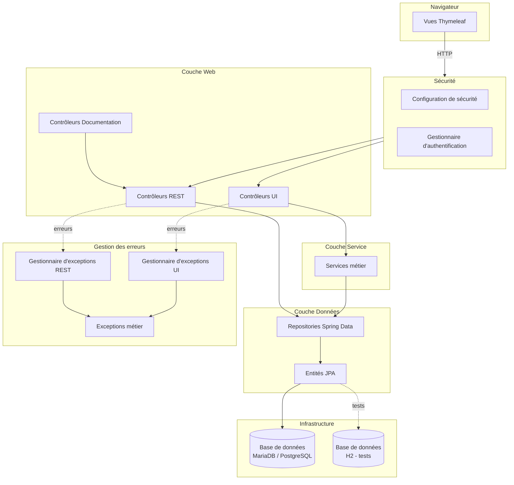

# Architecture logicielle — ALTN72 Projet Sara Théo Manon

Application web Spring Boot de gestion des apprentis EFREI (suivi des entreprises, tuteurs, missions, mémoires et visites).

---

## Vue d'ensemble — Architecture en couches

---

## Stack technique

| Composant | Technologie |
|-----------|-------------|
| Framework backend | Spring Boot 3.5.6 |
| Langage | Java 17 |
| Persistance | Spring Data JPA + Hibernate |
| Base de données (prod) | MariaDB / PostgreSQL |
| Base de données (test) | H2 |
| Sécurité | Spring Security (InMemory) |
| Template engine | Thymeleaf + Layout Dialect |
| Documentation API | Springdoc OpenAPI / Swagger UI |
| Conteneurisation | Docker + Docker Compose |
| Build | Maven |
